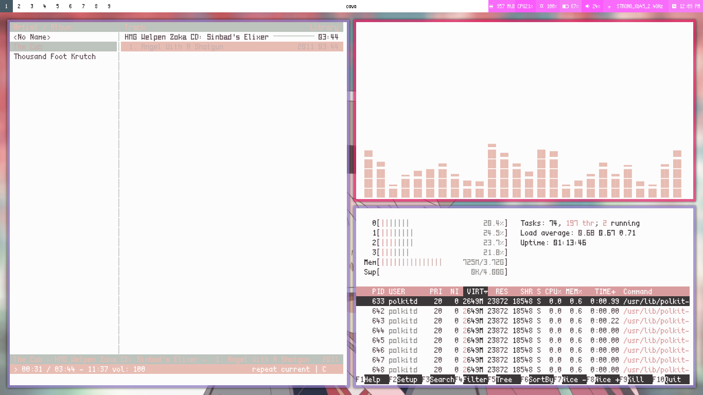

# pinkhead

A light, pastel, pink LeftWM theme heavily inspired by (and modified from) the [Soothe](https://github.com/b4skyx/leftwm-soothe/) LeftWM theme.  
Here's how the theme looks like with everything properly configured:  

# Requirements

- [pywal](https://github.com/dylanaraps/pywal)
- [feh](https://github.com/derf/feh)
- [picom](https://github.com/yshui/picom) or [compton](https://github.com/chjj/compton)
- [polybar](https://github.com/polybar/polybar)
- [scientifica](https://github.com/NerdyPepper/scientifica)
